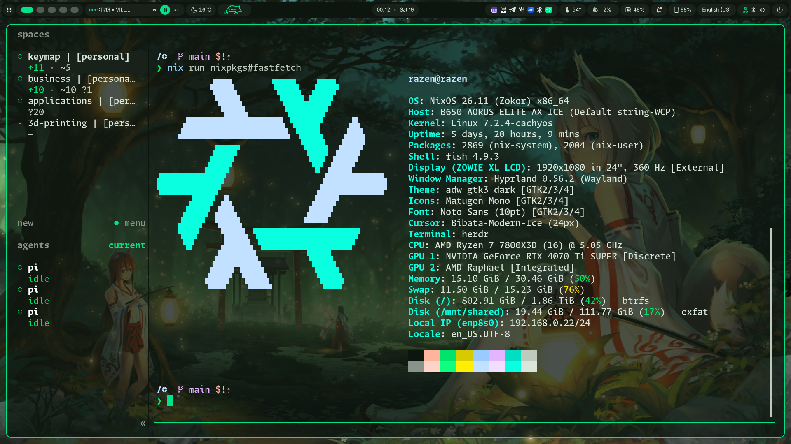

# Dotfiles



## Tooling

| Layer      | Tooling                                                     |
| ---------- | ----------------------------------------------------------- |
| OS         | NixOS + CachyOS kernel                                      |
| Compositor | Niri + Hyprland                                              |
| Shell      | DankMaterialShell                                           |
| Terminal   | WezTerm + herdr + fish                                      |
| Editor     | [Neovim](https://github.com/rzssh/nvim)                     |
| Keyboard   | [Custom 34 keys alt layout](https://github.com/rzssh/keebs) |

## Install

This installs my machine setup, not a generic NixOS configuration.

```sh
curl -fsSL https://raw.githubusercontent.com/rzssh/dotfiles/main/install.sh | bash
```

```sh
nh os switch            # rebuild (flake path preconfigured)
```

## Dev shells

```sh
nh init rust            # in any project: copies the template + direnv allow
```
